# <h1>Final Project Documentation
### <h1>EventBoard <h3> Online Event Management Web Application
#####<h5> Prepared By: Niya Anil, Toral Panasuria, Minal Patel, Ravina Trivedi
#####<h5> App Link: https://stark-island-98862.herokuapp.com/ 

####<h4> INTRODUCTION
  
Event management software is an event planner's best friend.EventBoard is a event management web application developed in REACT JS and NODE JS with mongodb as the backend database.It facilitates online registration for different kinds of events such as games, workshops and seminars. This projects main objective is to control or manage the activities and duties to be performed by various event conductors such as attendees, organizersand authors. It is a simple , flexible and easy to use web application 
  
  This project has two modules - admin and user. Both admin and registered users can create update and view events. User have to register first inorder to view the available events and register for that. Once a user register for an event, an email will be triggered to user email. Admin can view the registered user and update or delete them. Besides registration and other event creation options, there will be frequently asked FAQ page, aboutus page of event board, contact us page whiere user can send message to admin.
  
  ####<h4> Targeted audience and objective
  
  With this web application we aim to target users who would like to network and attend different events. Similarly for various event conductors such as attendees, organizersand authors. 

####<h4> Requirement Specifications
  
  #####<h5> Software Requirement
  ######<h6> 
   * Operating System: Windows 10
   * IDE: Visual Studio Code
   * Programming Language : NodeJS, REACT JS
   * Model: Watefall Model
   * Database: MongoDB
  
  #####<h5> Hardware Requirement
  ######<h6>
   * Processor: Intel core i7
   * Processor speed: 3.40 GHz
   * RAM: 8 GB
  
####<h4> List of Features
  
  #####<h5> ADMIN FEATURES  (by Minal Patel)
  
  * Admin login page.
  * View/Edit/Delete/Add company, faqs page.
  * Contact us page.
  * List of all registered users, contacted users page.
  * Admin Header.

 | Feature                                            | Component                                                                                                     | Files                                                        |
|----------------------------------------------------|---------------------------------------------------------------------------------------------------------------|--------------------------------------------------------------|
| Admin login page                                   | adminLogin.js                                                                                                 |                                                              |
| View/Edit/Delete/Add company, faqs page            | addcompany.js, addfaq.js,  company.js, deletecompany.js, deletefaq.js, faq.js, updatecompany.js, updatefaq.js | displaycompany.js,  displayfaqs.js, newcompany.js, newfaq.js |
| Contact us page                                    | contactus                                                                                                     | contactus.js                                                 |
| List of all registered users, contacted users page | users.js, contact.js                                                                                          | displayusers.js, displaycontact.js                           |
| Admin Header                                       | adminpanel                                                                                                    | header.js                                                    |

#####<h5> ATTENDEES FEATURE  (by Niya Anil)
  
  * Registration and login feature to use website.
  * About Us Page.
  * Event detail page for each event.
  * Sign In and Sign Out functionality.
                

| Feature                                       | Files                                             |
|-----------------------------------------------|---------------------------------------------------|
| Registration and login feature to use website | register.js, login.js, loginheader.js, history.js |
| About Us Page                                 | aboutUs.js                                        |
| Event detail page for each event              | registerEvent.js, use homepage.js                 |
| css for login and register form               | login.css, login.css.map, login.scss              |

	
#####<h5> ATTENDEES FEATURE  (Toral Panasuria)
  
  * User dashboard page.
  * Faqs Page.
  * Send email functionality for loggedin user.
  * Header and Footer Component.

| Feature                                    | Component      | Files                |
|--------------------------------------------|----------------|----------------------|
| User dashboard page                        | userdashboard  | homepage.js          |
| Faqs Page                                  | faq            | faq.js               |
| Send email functionality for loggedin user | Modal          | use registerEvent.js |
| Header and Footer Component                | header, footer | index.js             |

#####<h5> ATTENDEES FEATURE  (Ravina Trivedi)
  
  * Create Event Page.
  * Add, update and search functionality for event.
  * Review Page
  
| Feature                                        | Component        | Files                        |
|------------------------------------------------|------------------|------------------------------|
| Create Event Page                              | api              | axios.js, index.jsx          |
| Add, update and search functionality for event | view/competition | addUpdateForm.jsx, index.jsx |
| Review Page                                    | view/review      | index.jsx                    |

   ####<h4> Graphical User Interface 
  
  #####Admin Pages
  
   * Admin Login page
  
  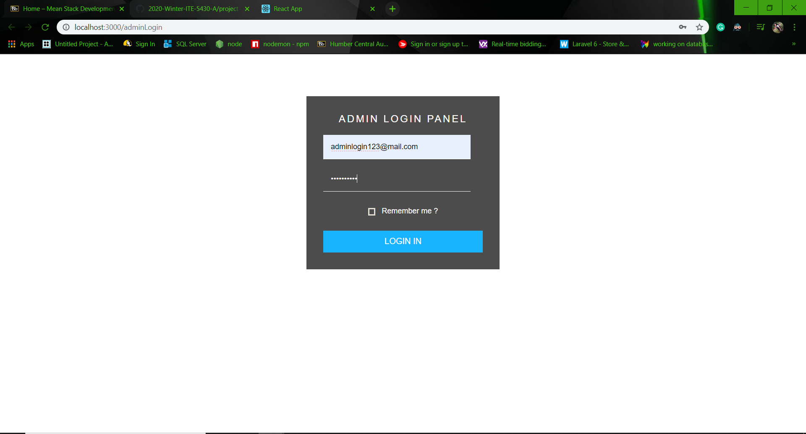
  
   * User Data Page
  
  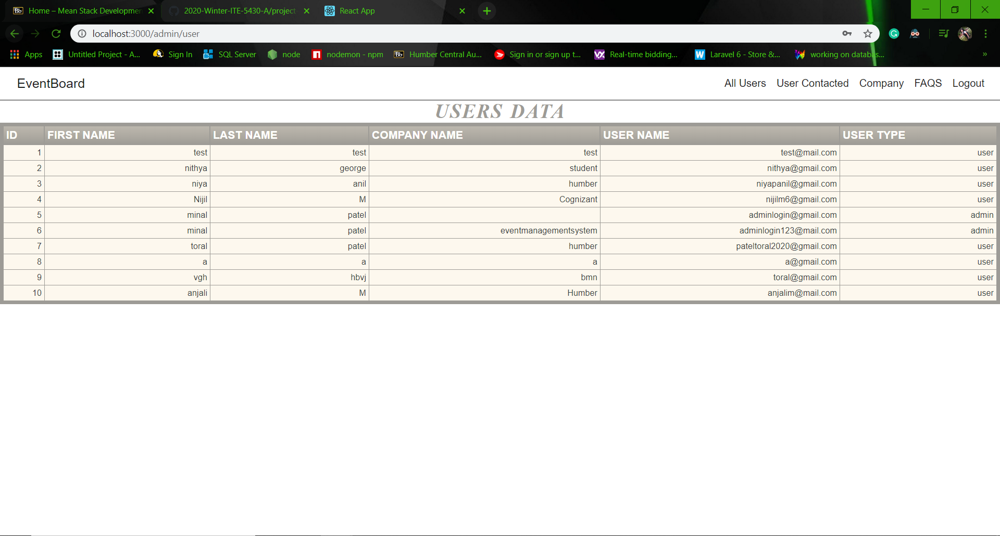
  
   * Contacted Users Data Page
  
  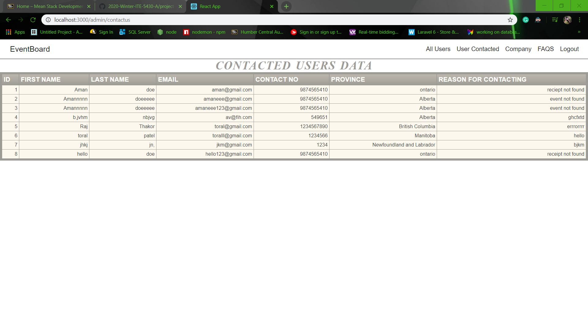
  
   * Company Data page
  
  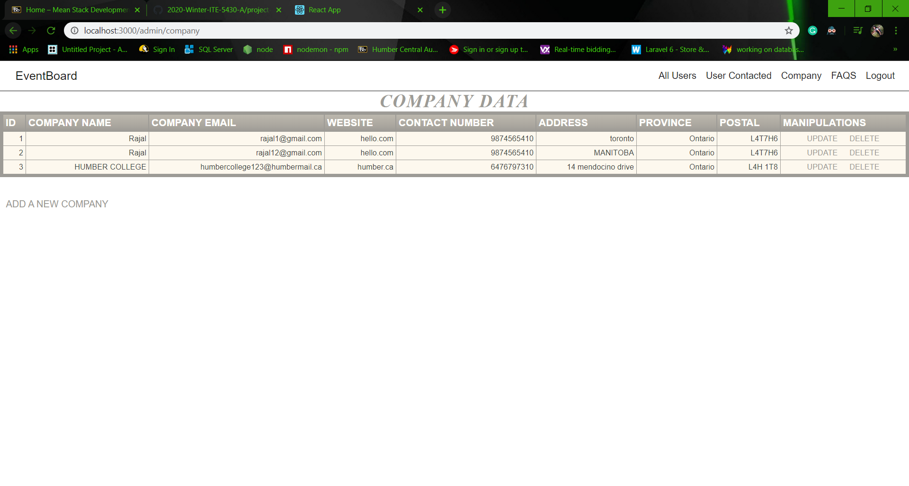
  
   * Add Company Page
  
  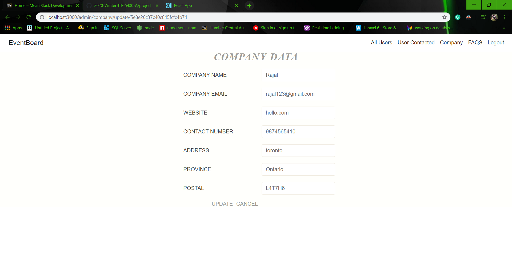
  
   * Update Company Page
  
  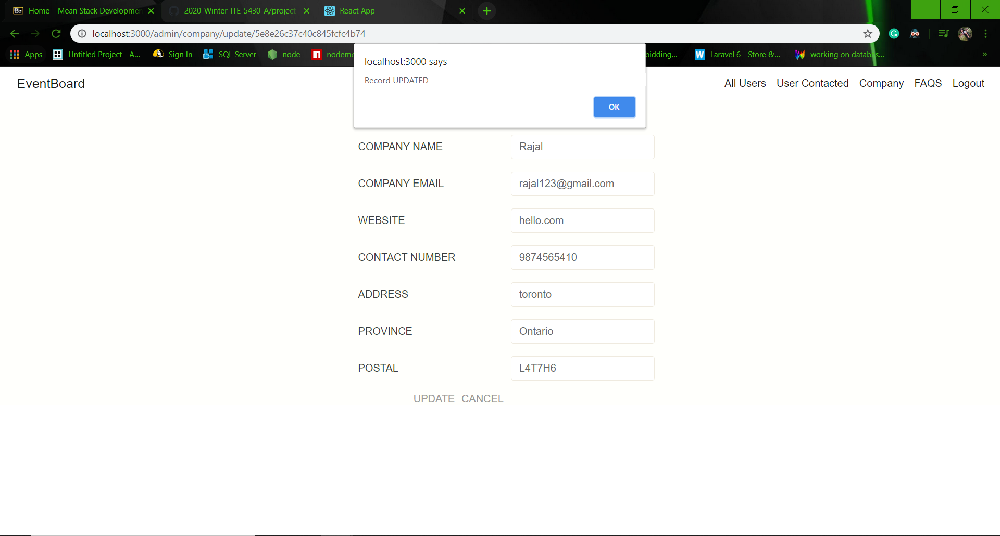
  
   * List Faqs Page
  
  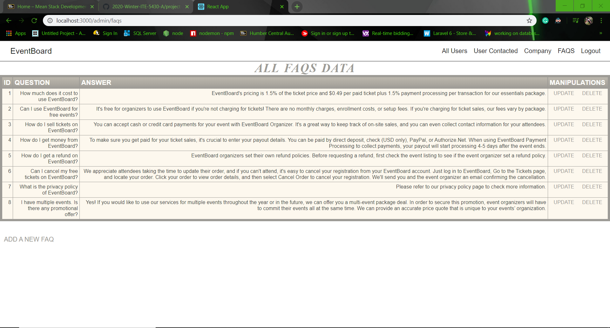
  
   * Add Faqs Page
  
  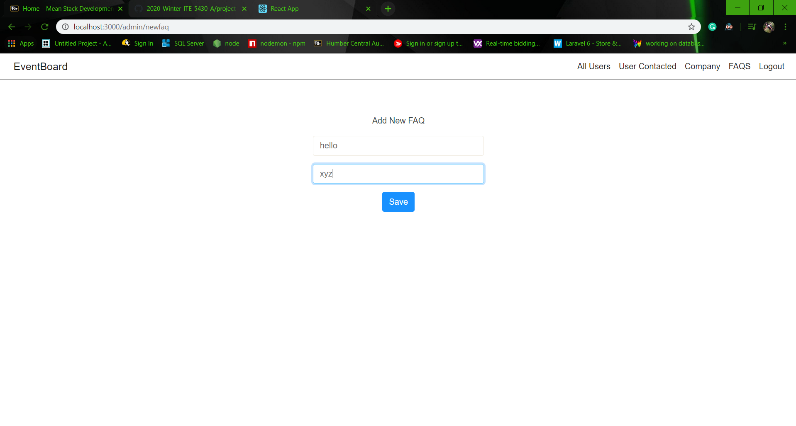
  
   * Update Faqs Page
  
  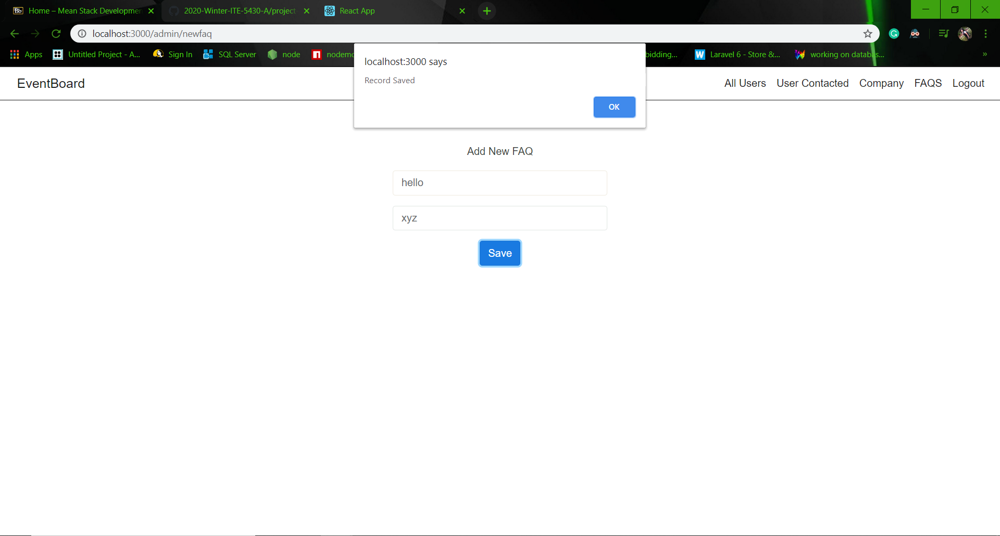
  
 
 
   #####Event Conductors Pages
   
  * User Sign Up Page
  
  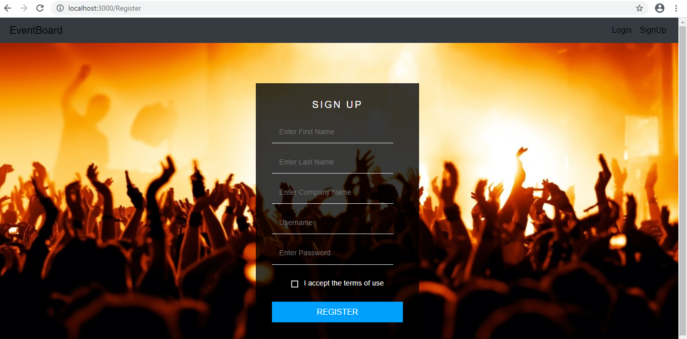
  
  * User Login Page
  
  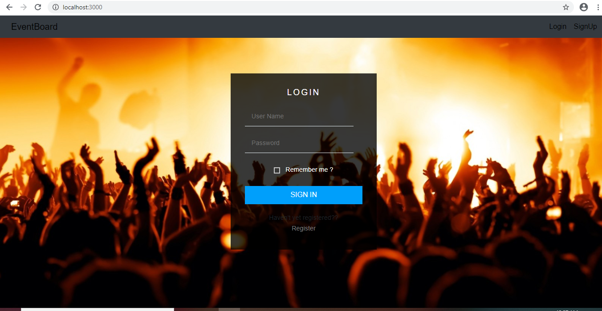
  
  * User Dashboard Page
  
  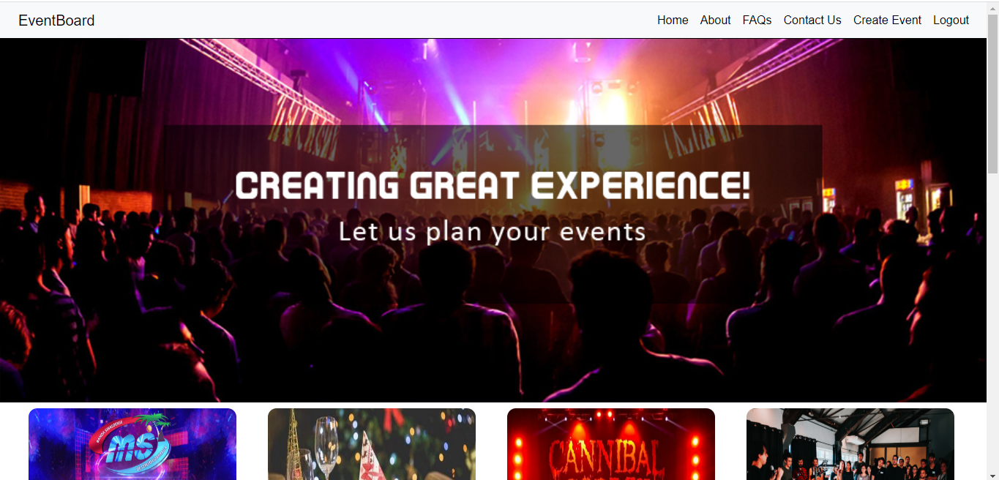
  
  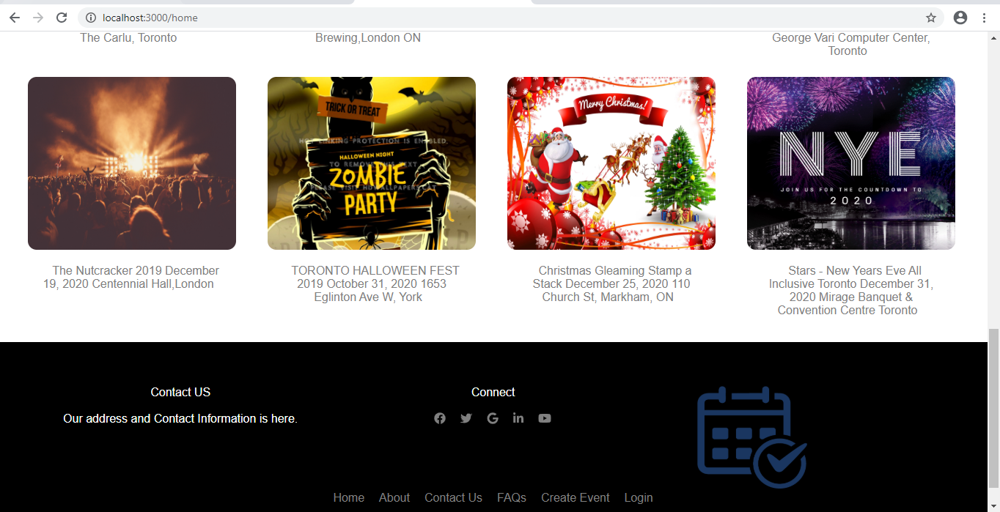
  
  * User About Us Page
  
  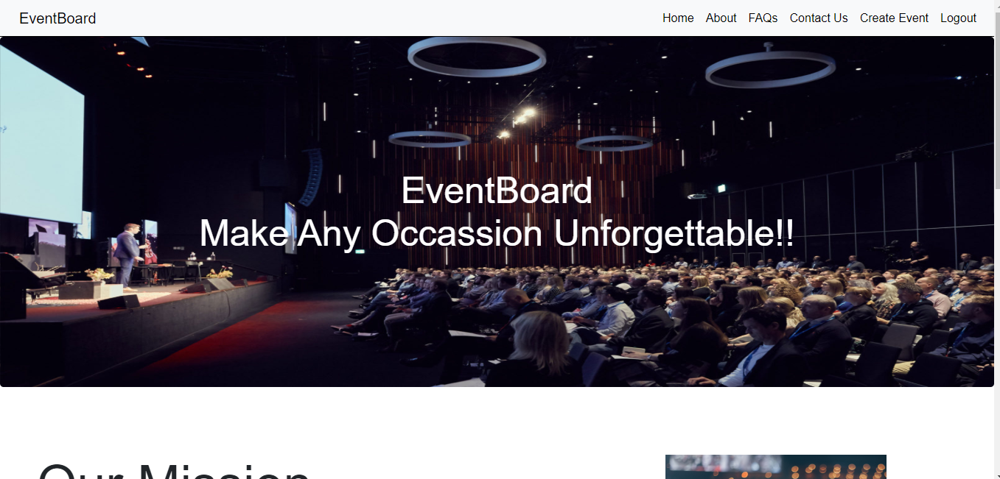
  
   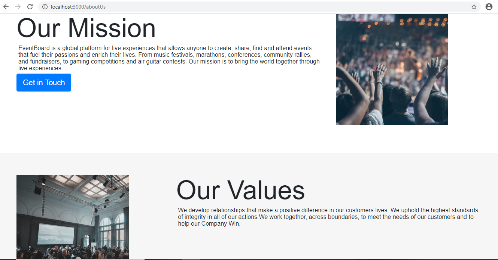
  
  * User Faq Page
  
  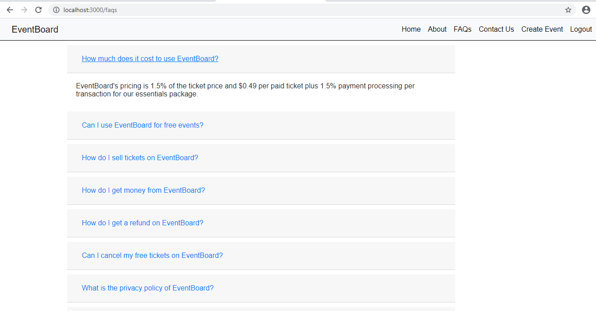
  
  * User Contact Us Page
  
  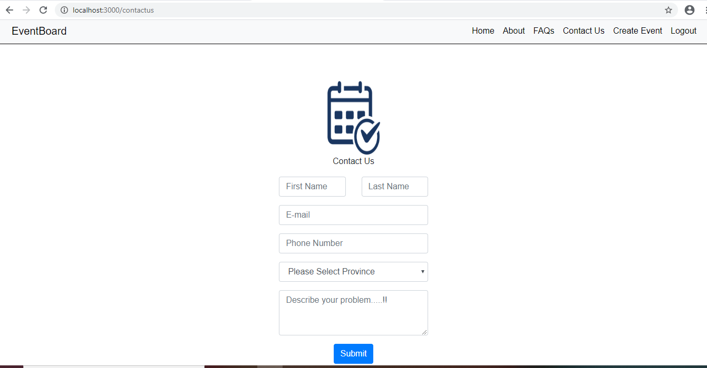
  
  * Event Detail Page
  
  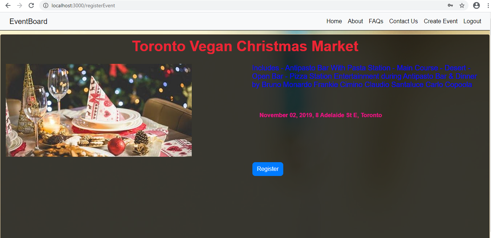
  
  * Send Email Page
  
  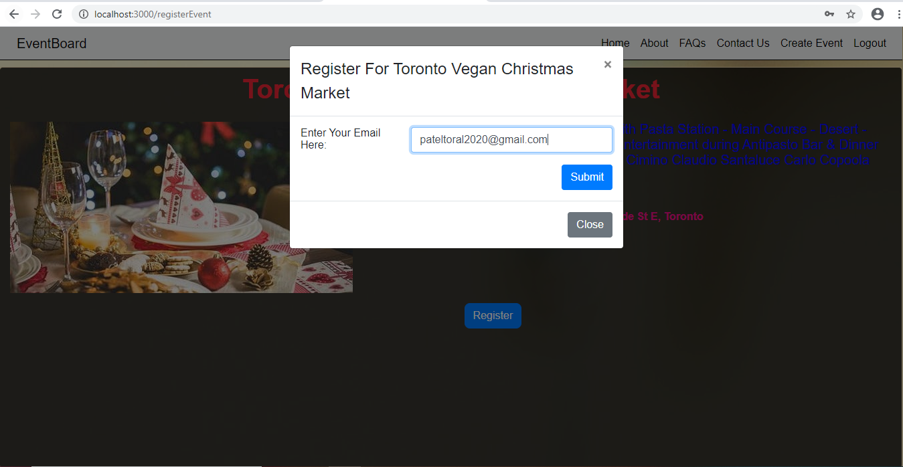
   

  ####<h4> Database Design
  
  The database that is used to design the web application is MySQL. We have used MySQL to store
employer details, jobseeker details, applied jobs by the applicants, jobs posted by the employer, contact us table for any person.
Hence, we have identified below tables to achieve desired functionality.

 
    
    1. user: Include the details of registered user including username and password
    2. company: Includes company information
    3. aboutUs: Include about us of the evenboard site
    4. faq: Include the frequently asked faq
    5. events: include information about the events
    6. contactus: include the user information with query to admin
